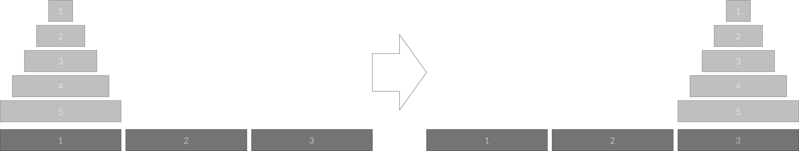

# 하노이 탑 이동 순서

- 시간 제한 : 1s
- 메모리 제한 : 256MB

### 문제

세 개의 장대가 있고 첫 번째 장대에는 반경이 서로 다른 n개의 원판이 쌓여 있다. 각 원판은 반경이 큰 순서대로 쌓여있다.<br>
이제 수도승들이 다음 규칙에 따라 첫 번째 장대에서 세 번째 장대로 옮기려 한다.

1. 한 번에 한 개의 원판만을 다른 탑으로 옮길 수 있다.
2. 쌓아 놓은 원판은 항상 위의 것이 아래의 것보다 작아야 한다.

이 작업을 수행하는데 필요한 이동 순서를 출력하는 프로그램을 작성하라. 단, 이동 횟수는 최소가 되어야 한다.

아래 그림은 원판이 5개인 경우의 예시이다.


### 입력



### 출력

첫째 줄에 첫 번째 장대에 쌓인 원판의 개수 N (1 ≤ N ≤ 20)이 주어진다.

### 예제

```python
3
```
```python
7
1 3
1 2
3 2
1 3
2 1
2 3
1 3
```
---
## 풀이
### 접근 방식

저의 힘 그 자체로 못풀었습니다... 재귀함수 생각은 했는데, 다른 방법이 나을거 같아서 시도하다 시간을 많이 날렸네요...

일단 노가다로 파보면,

- 1개 일 때

    원판 1을 1 -> 3로 옮긴다. (끗)

- 2개 일 때

    1. 원판 1을 1 -> 2로 옮긴다. `[[2], [1], [ ]]`
    2. 원판 2를 1 -> 3로 옮긴다. `[[ ], [1], [2]]`
    3. 원판 1을 2 -> 3로 옮긴다. `[[ ], [ ], [2, 1]]`
    끗

- 3개 일 때
    
    1. 원판 1을 1 -> 3로 옮긴다. `[[3, 2], [ ], [1]]`
    2. 원판 2를 1 -> 2로 옮긴다. `[[3], [2], [1]]`
    3. 원판 1을 3 -> 2로 옮긴다. `[[3], [2, 1], [ ]]`
    4. 원판 3을 1 -> 3로 옮긴다. `[[ ], [2, 1], [3]]`
    5. 원판 1을 2 -> 1로 옮긴다. `[[1], [2], [3]]`
    6. 원판 2를 2 -> 3로 옮긴다. `[[1], [ ], [3, 2]]`
    7. 원판 1을 1 -> 3로 옮긴다. `[[ ], [ ], [3, 2, 1]]`
    끗

- 4개 일 때

    1. 원판 1을 1 -> 2로 옮긴다. `[[4, 3, 2], [1], []]`
    2. 원판 2를 1 -> 3로 옮긴다. `[[4, 3], [1], [2]]`
    3. 원판 1을 2 -> 3로 옮긴다. `[[4, 3], [ ], [2, 1]]`
    4. 원판 3을 1 -> 3로 옮긴다. `[[4], [3], [2, 1]]`
    5. 원판 1을 2 -> 1로 옮긴다. `[[4, 1], [3], [2]]`
    6. 원판 2를 2 -> 3로 옮긴다. `[[4, 1], [3, 2], [ ]]`
    7. 원판 1을 1 -> 3로 옮긴다. `[[4], [3, 2, 1], [ ]]`
    8. 원판 4를 1 -> 3로 옮긴다. `[[ ], [3, 2, 1], [4]]`
    9. 원판 1을 2 -> 3로 옮긴다. `[[ ], [3, 2], [4, 1]]`
    10. 원판 2를 2 -> 1로 옮긴다. `[[2], [3], [4, 1]]`
    11. 원판 1을 3 -> 1로 옮긴다. `[[2, 1], [3], [4]]`
    12. 원판 3을 2 -> 3로 옮긴다. `[[2, 1], [ ], [4, 3]]`
    13. 원판 1을 1 -> 2로 옮긴다. `[[2], [1], [4, 3]]`
    14. 원판 2를 1 -> 3로 옮긴다. `[[ ], [1], [4, 3, 2]]`
    15. 원판 1을 2 -> 3으로 옮긴다. `[[ ], [ ], [4, 3, 2, 1]]`
    끗


열심히 써봤다. 재귀 함수로 풀 수 있는 문제는 절차지향으로 풀기 정말 정말 어렵다.
 
__재귀(recursion)란 같은 형태의 보다 작은 입력을 지닌 자기 자신을 호출하는 것이고, 이렇게 재귀적인 호출을 사용하는 함수를 재귀함수라고 한다.__

이제 우리는 잘 생각해보자.

비슷한 패턴이 발견된다. N 원판 이전 원판들이 2에 차례대로 쌓여져 있어야 N 원판이 3으로 이동 할 수 있다.

그리고 뒤에 n-1개의 원판들(1 ~ n-1)이 다시 3으로 이동하는 모습을 보여준다.

위에 내가 노가다했던것을 참고해보자

1. 우리는 N을 기둥 3으로 보내기 전에 N-1 기둥을 2로 보내야한다.
2. N을 3으로 보내고 우리는 N-1의 원판들을 3으로 다시 이동시켜야한다.

이걸 봤을 때, 비슷한 모습이 목적지만 다르지 똑같은 행위를 반복한다고 볼 수 있다.

우리는 여기서 출발지와 도착지 그리고 경유점만 바꿔서 입력을 해준다면, 좀 더 재귀함수를 짜기 쉽지 않을까?

N일 때,
start = 1
aux = 2
end = 3
의 인자와

N-1일떄,
start = 2
aux = 1
end = 3
으로 볼 수 있겠다.

그렇다면, 함수를 직접 만들어보자.

아 맞다. 참고로 노가다로 해봤을 때 총 이동 횟수가 `2^n - 1`인 것을 확인 할 수 있다.

```python
n = int(input())

def hanoi(n, start, aux, end):
"""
n: 원판의 갯수
start: 첫 기둥
aux: 보조 기둥
end: 끝 기둥

"""
    if n == 1: # N이 1이라면, 그냥 옮기면 된다.
        print(start, end)
    else:
        # 우리는 일단 N-1의 원판들을 보조기둥인 2로 옮겨야한다. 그렇다면 3을 보조기둥으로 놓을 수 있다.
        hanoi(n - 1, start, end, to)
        # 이 부분이 어디로 옮겼는지 출력
        print(start, end)
        # 이 함수를 실행한다면 우리는 이미 N-1을 2로 옮겼다 그렇다면 우리는 1을 보조기둥으로 놓고 다시 3으로 옮겨야 한다.
        hanoi(n - 1, to, start, end)

print(2 ** n - 1)
hanoi(n, 1, 2, 3)
```

### 그냥 공부했도르...
이게 결국 패턴을 찾아야하는게 핵심인거 같다.

단서를 찾기 어렵다면 일단 하나씩 해보고 눈을 크~게 뜨고 찾아봐야하는데, 나는 그게 잘 안된듯...

일단 짝수일 때랑 홀수일 때 1을 어디다 먼저 두는지에 꽂혀서 보기 힘들었던 것 같다...