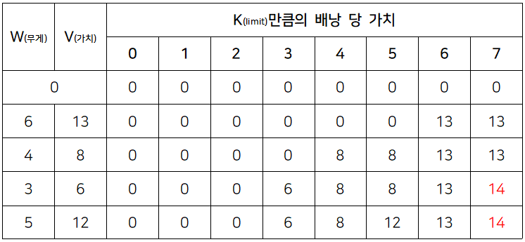

# 평범한 배낭

- 시간 제한 : 2s
- 메모리 제한 : 512MB

### 문제

이 문제는 아주 평범한 배낭에 관한 문제이다.

한 달 후면 국가의 부름을 받게 되는 준서는 여행을 가려고 한다. 세상과의 단절을 슬퍼하며 최대한 즐기기 위한 여행이기 때문에, 가지고 다닐 배낭 또한 최대한 가치 있게 싸려고 한다.

준서가 여행에 필요하다고 생각하는 N개의 물건이 있다. 각 물건은 무게 W와 가치 V를 가지는데, 해당 물건을 배낭에 넣어서 가면 준서가 V만큼 즐길 수 있다.<br>
아직 행군을 해본 적이 없는 준서는 최대 K만큼의 무게만을 넣을 수 있는 배낭만 들고 다닐 수 있다. 준서가 최대한 즐거운 여행을 하기 위해 배낭에 넣을 수 있는 물건들의 가치의 최댓값을 알려주자.


### 입력

첫 줄에 물품의 수 N(1 ≤ N ≤ 100)과 준서가 버틸 수 있는 무게 K(1 ≤ K ≤ 100,000)가 주어진다. 두 번째 줄부터 N개의 줄에 거쳐 각 물건의 무게 W(1 ≤ W ≤ 100,000)와 해당 물건의 가치 V(0 ≤ V ≤ 1,000)가 주어진다.

입력으로 주어지는 모든 수는 정수이다.

### 출력

한 줄에 배낭에 넣을 수 있는 물건들의 가치합의 최댓값을 출력한다.

### 예제
```
4 7
6 13
4 8
3 6
5 12
```
`14`

---
## 풀이

### 접근 방식

진짜 매번 놀라움을 금치 못하는 DP 문제

맨날 삽질하다가... 이거 도대체 조건문을 어떻게 짜야해? 하다보면 유형은 언제나 DP였다.<br>
큰 문제를 어떻게 작은 문제로 나누고, 그 문제에 대해 중복 연산을 안하는데요???

그래서 열심히 짱구를 굴린 결과<br>
물건 전체에 대해 for문을 돌리고 제한 무게부터 그 물건에 대한 무게까지 최고의 가치를 가지는가?
쉽게 말하면

이전에 해당 무게의 최고 가치값을 미리 다 저장하기로하고, 지금 도는 아이템이랑 비교해보는거임
그리고 최고값 갱신하고... 피보나치 수열 때도 이전에 연산했던 피보나치 값 저장해두잖아요

그러면 어떻게 해야할까 
1. 최고값 구하는 리스트 따로 만들기
2. 물건 전체 for문 돌기
3. 제한 무게 ~ for문 도는 물건 무게까지
4. 만약 제한무게에 해당하는 최고값과 (제한무게 - i 물건 무게)의 최고 값 + 물건 가치 중 누가 더 큰지?
5. 큰놈이 이젠 최고값이여

코드로 보자


### 코드

```python
# 입력
# n: 입력받을 물건 갯수, limit: 배낭 용량, item: 물건 리스트, dp: 최고값 저장 리스트
n, limit = map(int, input().split())
item = [list(map(int, input().split())) for _ in range(n)]
dp = [0] * (limit + 1) #인덱스 헷갈리니까 +1 했음

# 로직

for weight, value in item: # 아이템의 무게와 가치를
    for i in range(limit, weight - 1, -1): # 제한 무게부터 물건 무게까지
        dp[i] = max(dp[i], dp[i - weight] + value) # 지금 저장된 최고값 vs 지금 물건 가치 + (배낭 용량 - 물건 무게)에 해당하는 최고 값 중
        # 누가 더 큰지 ? 큰 놈이 저장되는겨
        
print(dp[limit])

```

## 다른 사람 풀이

### 접근 방식

DP를 사용할 수 있는 조건
1. 큰 문제를 작은 문제로 나눌 수 있을 때
2. 작은 ㅜㅁㄴ제에서 구한 솔루션으로 큰 문제의 솔루션을 구할 수 있을 때
3. 작은 문제들이 중복되어 나타날 때

메모이제이션 사용



limit 값과 무엇을 구하고자 하는지 파악하는게 관건
"limit 만큼 넣을수 있는 배낭"에서 "물건들의 가치의 최댓값"을 요구


### 코드

```python
import sys
input = sys.stdin.readline

N, K = map(int, input().split())
bag = [list(map(int, input().split())) for _ in range(N)]
dp = [[0]*(K+1) for _ in range(N+1)]

for i in range(1,N+1):
    for j in range(1,K+1):
        if j >= bag[i-1][0]:
            dp[i][j] = max(bag[i-1][1]+dp[i-1][j-bag[i-1][0]],dp[i-1][j])
        else:
            dp[i][j] = dp[i-1][j]

print(dp[N][K])

```

출처 [keynene velog](https://velog.io/@keynene/Python%ED%8C%8C%EC%9D%B4%EC%8D%AC5-%EB%B0%B1%EC%A4%80-%EC%95%8C%EA%B3%A0%EB%A6%AC%EC%A6%98-12865-%ED%8F%89%EB%B2%94%ED%95%9C%EB%B0%B0%EB%82%AD)