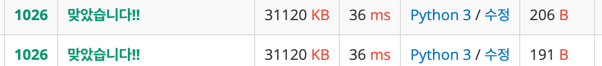

# 보물

- 시간 제한 : 2s
- 메모리 제한 : 128MB

### 문제

옛날 옛적에 수학이 항상 큰 골칫거리였던 나라가 있었다. 이 나라의 국왕 김지민은 다음과 같은 문제를 내고 큰 상금을 걸었다.

길이가 N인 정수 배열 A와 B가 있다. 다음과 같이 함수 S를 정의하자.

`S = A[0] × B[0] + ... + A[N-1] × B[N-1]`

S의 값을 가장 작게 만들기 위해 A의 수를 재배열하자. 단, B에 있는 수는 재배열하면 안 된다.

S의 최솟값을 출력하는 프로그램을 작성하시오.


### 입력
첫째 줄에 N이 주어진다. 둘째 줄에는 A에 있는 N개의 수가 순서대로 주어지고, 셋째 줄에는 B에 있는 수가 순서대로 주어진다.

N은 50보다 작거나 같은 자연수이고, A와 B의 각 원소는 100보다 작거나 같은 음이 아닌 정수이다.


### 출력
첫째 줄에 S의 최솟값을 출력한다.


### 예제
```angular2html
5
1 1 1 6 0
2 7 8 3 1
```
`18`

---
## 풀이

### 접근 방식
답을 내는데 결과값만 내놓는다면, 굳이 B를 움직이면 안되는 이유가 없다고 생각이 들었다.<br>
사실 정렬한 A를 출력하시오 했으면 좀 더 귀찮았을 텐데 결과값만 내놓으라니<br>
A는 오름차순, B는 내림차순해서 곱한다음 값 내면 끝 아닌가? 하고 풀었더니 정답이였다.

### 코드
```python
n = int(input())
a = list(map(int, input().split()))
b = list(map(int, input().split()))
answer = 0

a.sort()
b.sort(reverse=True)

for i in range(n):
    answer += a[i] * b[i]

print(answer)
```

## 다른 사람 풀이

### 접근 방식
사람들 생각은 다 똑같나보다. 나처럼 생각했다가 그냥 출제 의도에 당해준다.

오히려 효율이 떨어지는 방향이긴하다.<br>
각 리스트에서 최대 최소값 뽑아서 곱한다음 더하기.

사실 이거 말고 그냥 A를 각각 자리에 맞게 정렬하는걸 원하지 않았을까?

### 코드

```python
n = int(input())
a = list(map(int, input().split()))
b = list(map(int, input().split()))
answer = 0

for _ in range(n):
    answer += max(a) * min(b)
    a.remove(max(a))
    b.remove(min(b))

print(answer)
```

근데 막상 해보니 시간 차이도 안난다.
